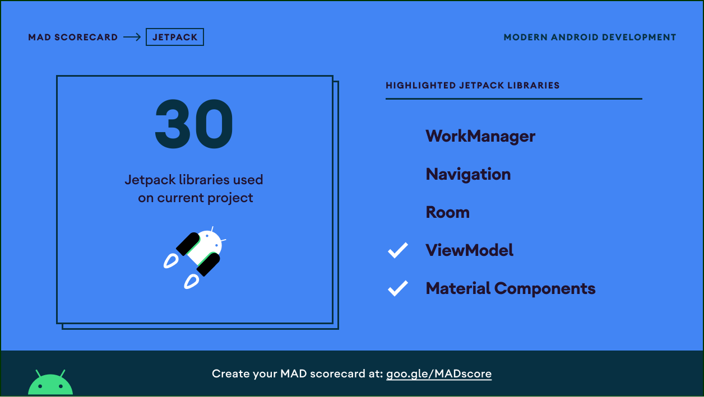
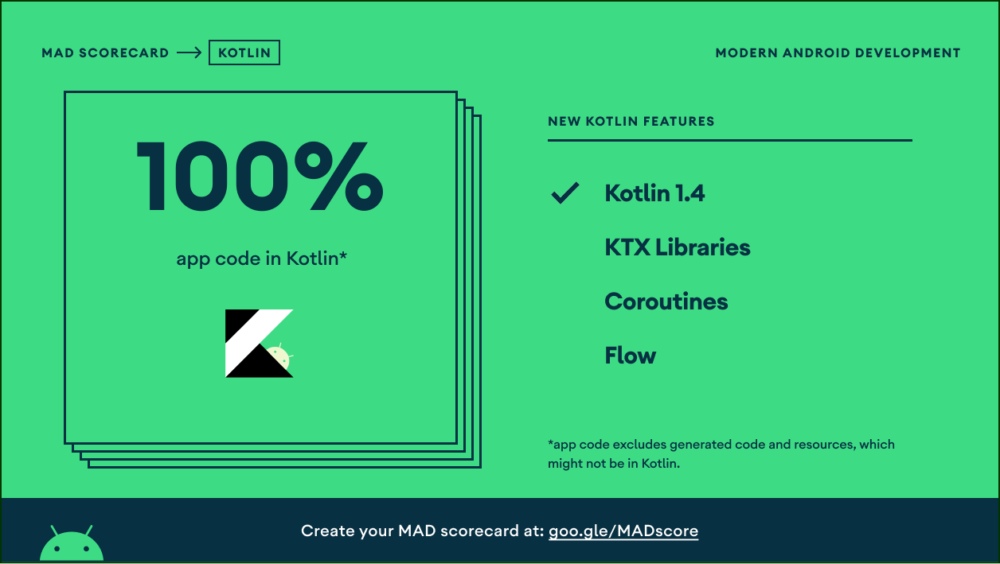
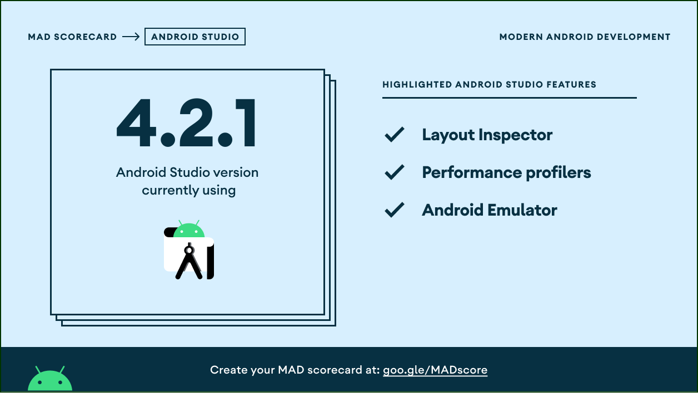

# Tip Calculator

This is a utility based Android Application to calculate the tip

This repositor is based on [Android Basics in Kotlin Course](https://developer.android.com/courses/android-basics-kotlin/course)
-   Unit 2: Layout
    -   Get user input in an app: Part 1
    
## MAD Scorcard

## More Codelab
-   [Change the app theme](https://developer.android.com/codelabs/basic-android-kotlin-training-change-app-theme#0)
-   [Change the app icon](https://developer.android.com/codelabs/basic-android-kotlin-training-change-app-icon#0)
-   [Create a more polished user experience](https://developer.android.com/codelabs/basic-android-kotlin-training-polished-user-experience#0)